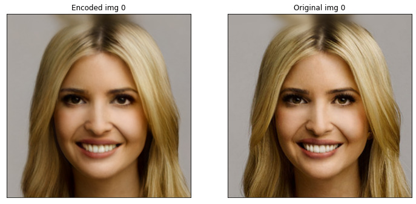
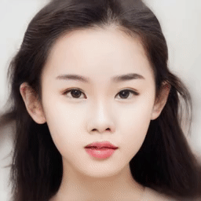

# Real Image Manipulation under Domain-Guided-Noise-Optimization Mechanism

Do facial image Manipulation on Google Colab: 

Notice: the image is display properly now. The .gif file is converted by using website tool and some details are missing. More details will be uploaded.

Image2Latent Semantic Results
------------

 

## Encoding an image into StyleGAN2 latent space

 

Manipulate attribute Results
------------
| Modify Faces | | |
| :-- | :-- |:-- |
| Eye Closed | Pose | Star|
|
 
|

|

|

Introduction Notebook
------------------

We provide a jupyter notebook example to show how to use DNI for facial image manipulation: `/DNI-code/DNI.ipynb`.

We also provide a colab version of the notebook: . Be sure to select the GPU as the accelerator in runtime options.

Psp Encoder architecture
----------------------
More details for the Psp model, please see [here](https://github.com/eladrich/pixel2style2pixel)

## Youtube Video

Please visit the [Youtube](https://www.youtube.com/watch?v=KrcCRZs7J98&feature=youtu.be) video for better understanding!

## Related Projects

**[StyleFlow](https://github.com/RameenAbdal/StyleFlow) | [Psp Model](https://github.com/eladrich/pixel2style2pixel) | [StyleGAN2Encoder](https://github.com/bryandlee/stylegan2-encoder-pytorch) | [StyleGAN2](https://github.com/NVlabs/stylegan2)**
