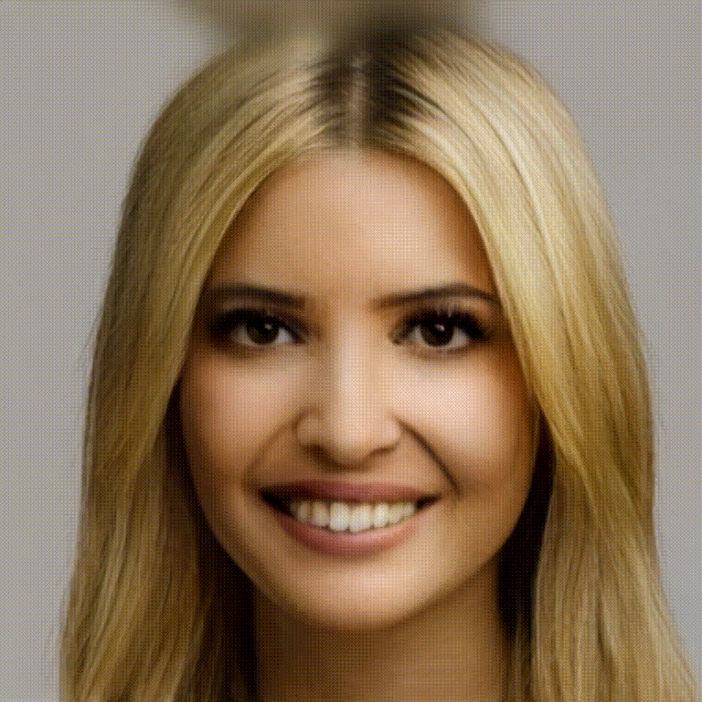

# Real-Image-Manipulation-under-Domain-Guided-Noise-Optimization-Mechanism

Notice: the image is display properly now.

Image2Latent Semantic Results
------------

 

Manipulate Eye Results
------------
| Modifiy Faces | |
| :-- | :-- |
| Eye Closed | Pose |
|
 
|

|

More Details
----------------
Please visit the [Youtube](https://www.youtube.com/watch?v=KrcCRZs7J98&feature=youtu.be) video for better understanding!
